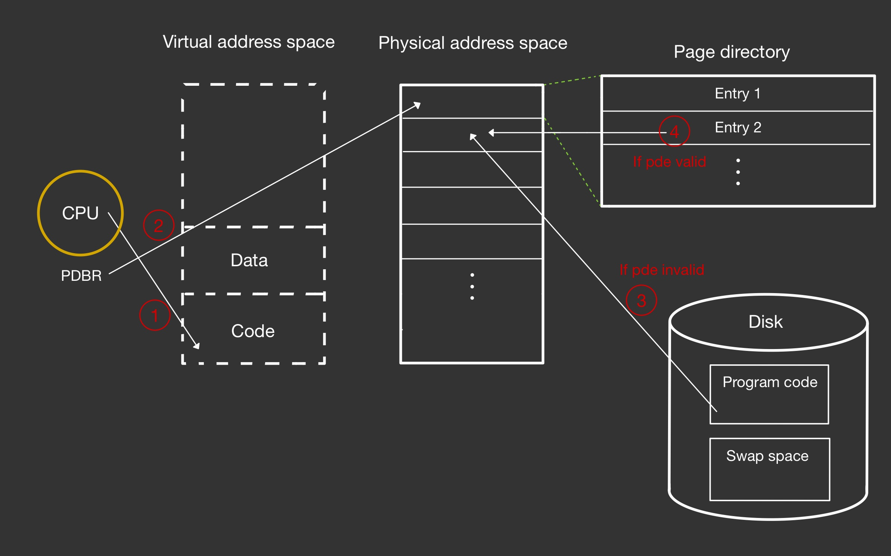
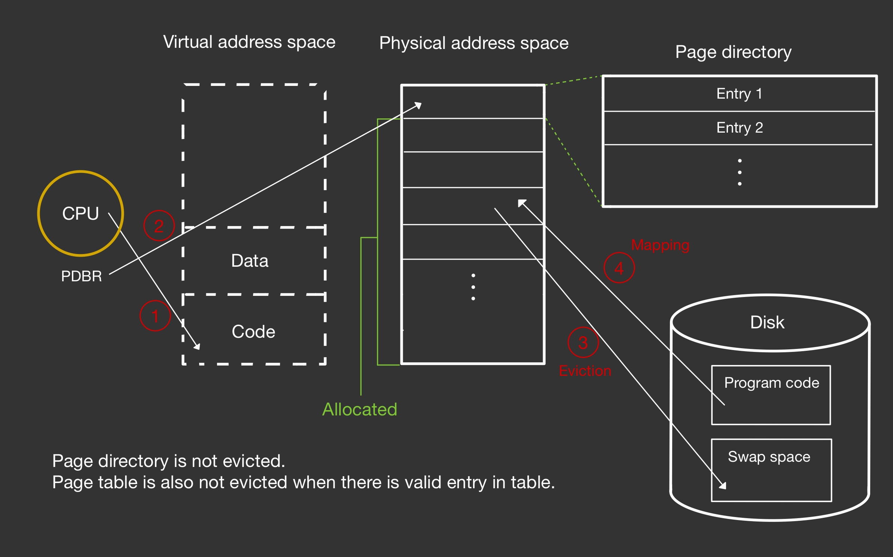
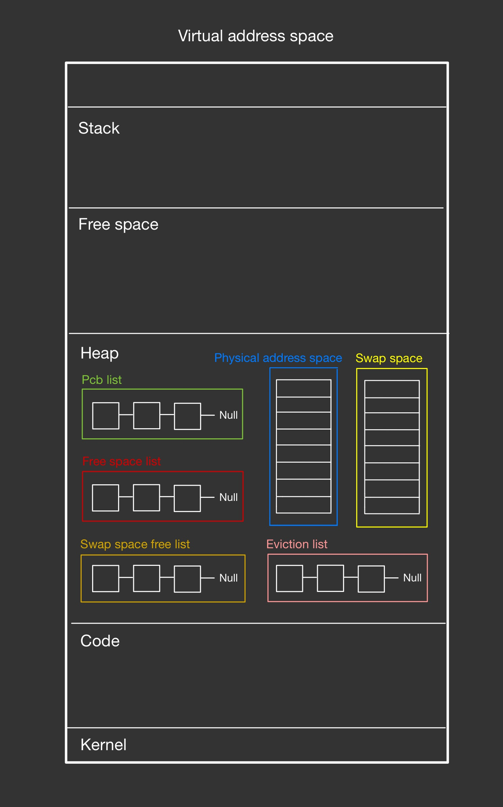
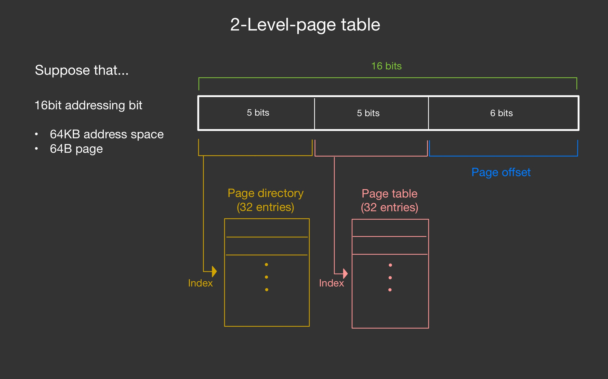
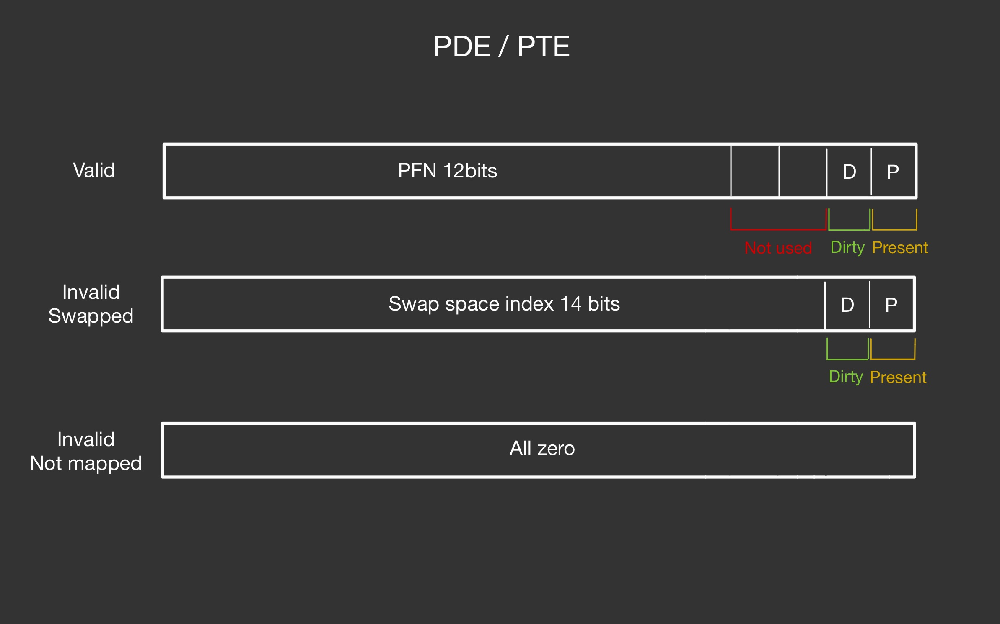

# MMU

implement of Memory Management Unit (MMU) in virtual environment.

Assignment for Konkuk University, 'Operating system' class 2024, professor Hyun-Wook Jin

## Introduction

In real computer environment, because of limited memory space, OS should have Memory Management Unit. For implementation of MMU, code in kumoo.c provides us virtual environment like real CPU working environment (context switching, accessing Virtual memory space etc..) 

I implemented 5 main function in kumoo.h. And then, kumoo.c use this function.

 

## Whole Process Diagram

 
When CPU access virtual address space, memory virtualization work like above architecture.

 

 
If CPU want to access virtual address space that not mapped in memory but there is no free space, memory virtualization swap out any page in memory to swap space in disk. Swap out candidation is decided by OS provider. (LRU, Random etc...)

 

## Implementation Diagram

Because of HW limit, in this code, HW environment is implemented as code in kumoo.c. Physical address space & Swap space is dynamic allocated space, so both space is located in heap. (Real virtaul address space for this project) 

 
And Pcb list, Physical free space list, swap free space list, eviction candidation list is implemented linked list, so that lists is located in heap. 

 
So, all HW, SW environment is implemented in one virtual address space. It is just simulation for test of MMU working.

 
 

## Suppose

 
In this project, we suppose that addressing bits size is 16. So virtual address space's size is 64KB. (2^16 KB) And we suppose that page size is 64B. So there is 1000 pages in one virtual address space. 

We suppose 2-Level-page table. Page directory and Page table. 

 

 
This picture is diagram of PDE/PTE. PDE means Page Directory Entry / PTE means Page Table Entry. If PDE/PTE is valid, it has PFN that matched VPN. (index of PD/PT) D block means dirty bit. If space that PFN pointing is changed, dirty bit of PDE/PTE is setting 1. P block means present bit. If space that PFN is mapped, present bit is setting 1.

All zero address means invalid address. It means not mapped yet.

 

## Main function

 
Above picture of function explain is written by me when I submitted this code as OS class assignment task. 

 

## Things I regret

1. Because of assignment deadline, I implemented this project without following The Clean Code law. All function and variable is named without representing own role. And all logic is implemented in one file. (kumoo.h) I will do refactoring someday.

2. This assignment is tested by 4 steps. When I submit this code, I checked that my code can pass step 3, but can't pass 4th step, environment of Multi-process case (include swap case). My code can swap in/out, but swap target is not equal what I want. I coundn't find cause at that time.